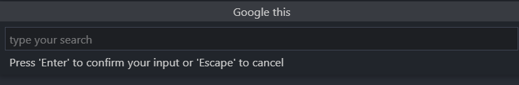

## Features
Google it extension helps you quickly run google search query right in your vscode.

Press "Ctrl" + ";" to open an input box at the top of the window. Write your question there and your default browse will google it.

## Press "Ctrl ;"

## Why is this extension helpful?

* Very Quickly open and search google
* Easily type key binding 
* Don't have to use your mouse

Happy Coding and Googling !!
